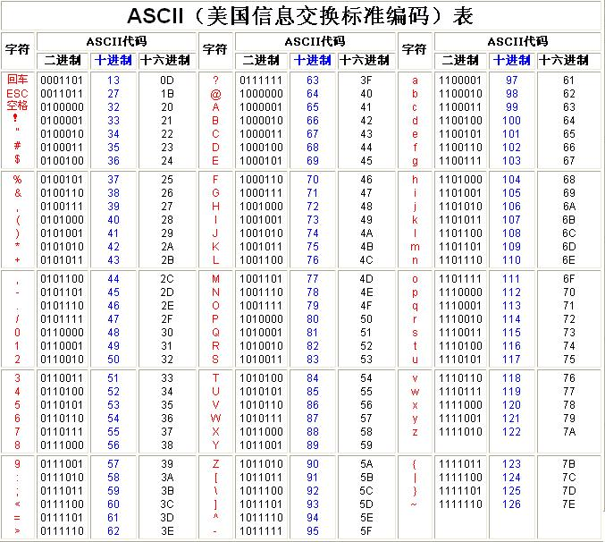

### Python中Unicode字符串

字符串还有一个编码问题。

因为计算机只能处理数字，如果要处理文本，就必须先把文本转换为数字才能处理。最早的计算机在设计时采用8个比特（bit）作为一个字节（byte），

所以，一个字节能表示的最大的整数就是255（二进制11111111=十进制255），0 - 255被用来表示大小写英文字母、数字和一些符号，

这个编码表被称为ASCII编码，比如大写字母 A 的编码是65，小写字母 z 的编码是122。



如果要表示中文，显然一个字节是不够的，至少需要两个字节，而且还不能和ASCII编码冲突，所以，中国制定了GB2312编码，用来把中文编进去。

类似的，日文和韩文等其他语言也有这个问题。

为了统一所有文字的编码，Unicode应运而生。

Unicode把所有语言都统一到一套编码里，这样就不会再有乱码问题了。

Unicode通常用两个字节表示一个字符，原有的英文编码从单字节变成双字节，只需要把高字节全部填为0就可以。

因为Python的诞生比Unicode标准发布的时间还要早，所以最早的Python只支持ASCII编码，普通的字符串'ABC'在Python内部都是ASCII编码的。

Python在后来添加了对Unicode的支持，以Unicode表示的字符串用u'...'表示，比如：

```
print u'中文'
中文

```

#### 注意: 

不加 u ，中文就不能正常显示。

Unicode字符串除了多了一个 u 之外，与普通字符串没啥区别，转义字符和多行表示法仍然有效：

#### 转义：

```

u'中文\n日文\n韩文'

```

#### 多行：

```
u'''第一行
第二行'''

```
#### raw+多行：

```
ur'''Python的Unicode字符串支持"中文",
"日文",
"韩文"等多种语言'''

```
如果中文字符串在Python环境下遇到 UnicodeDecodeError，这是因为.py文件保存的格式有问题。

可以在第一行添加注释

```
# -*- coding: utf-8 -*-

```

目的是告诉Python解释器，用UTF-8编码读取源代码。然后用Notepad++ 另存为... 并选择UTF-8格式保存。

### 任务用多行Unicode字符串表示下面的唐诗并打印：

```
静夜思

床前明月光，
疑是地上霜。
举头望明月，
低头思故乡。

```

#### 链接

https://www.imooc.com/code/3271


